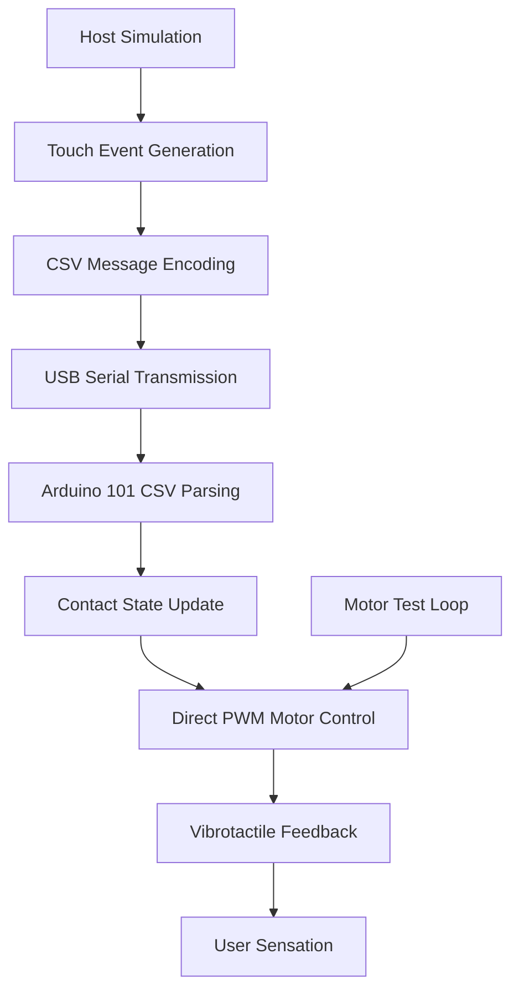

# Tact - Haptic Feedback System Product Requirements Document

## 1. Product Overview

Tact is a simplified mediated social touch system that captures touch events from VR-like environments and renders vibrotactile feedback on a wearable device using Arduino 101. This MVP prototype focuses on rapid assembly and testing within one hour, demonstrating core haptic feedback functionality.

The system translates virtual touch into physical sensations through discrete contact pulses and continuous pressure-like feedback using 3-4 vibrotactile motors. The prototype prioritizes simplicity and reliability over fidelity, serving as a proof-of-concept for haptic communication systems.

## 2. Core Features

### 2.1 User Roles

| Role | Registration Method | Core Permissions |
|------|---------------------|------------------|
| VR User | Direct device connection | Can send touch events, receive haptic feedback |
| System Administrator | Physical device access | Can configure sensitivity, calibrate motors, update firmware |

### 2.2 Feature Module

Our Tact MVP system consists of the following simplified components:

1. **VR Touch Simulation Interface**: basic collision simulation, penetration depth generation, first-contact event creation
2. **Serial Communication**: USB serial message transmission, CSV-format parsing, error handling
3. **Haptic Rendering Engine**: direct PWM motor control, fixed vibration parameters, contact state tracking
4. **Simplified Wearable**: 3-4 motor mounting on back of hand/forearm using velcro/tape
5. **Host Simulation Stub**: basic gesture simulation, manual testing interface

### 2.3 Page Details

| Component | Module Name | Feature Description |
|-----------|-------------|---------------------|
| VR Interface | Touch Event Simulation | Generate basic collision events with penetration depth (0-1 normalized) and first-contact flags |
| VR Interface | Gesture Simulation | Simple stroke, pat, poke, squeeze patterns for demonstration |
| Communication | Serial Protocol | CSV-format messages: actuator_id,penetration_depth,first_contact at 115200 baud |
| Communication | USB Serial Transport | Direct USB serial communication, no BLE implementation |
| Haptic Engine | Contact State Tracking | Per-actuator boolean state, first-contact detection, penetration threshold filtering |
| Haptic Engine | Fixed Vibration Control | Hardcoded parameters: 75ms pulse, 90% first contact, 20-70% sustained amplitude |
| Hardware | Direct PWM Control | Drive 3-4 motors directly from Arduino PWM pins, no external drivers |
| Hardware | USB Power | 5V power from USB connection, single motor limitation for current safety |
| Hardware | Simple Mount | Velcro/tape mounting on back of hand or forearm, 2-3 inch spacing |
| Testing | Basic Validation | Simple motor test loop, manual gesture demonstration |

## 3. Core Process

**MVP User Flow:**
1. Host application simulates virtual touch events
2. System generates penetration depth and first-contact flags
3. Touch data encoded as CSV: actuator_id,penetration_depth,first_contact
4. Message transmitted to Arduino 101 via USB serial at 115200 baud
5. Arduino parses CSV message and updates actuator state
6. First contact triggers 75ms pulse at 90% PWM, sustained contact scales 20-70% based on depth
7. User feels haptic feedback through 3-4 motors on wearable device

**Testing Flow:**
1. Connect Arduino 101 via USB
2. Run motor test loop to validate PWM functionality
3. Execute host simulation with predefined gesture patterns
4. Manually verify first-contact pulses and sustained vibration scaling



## 4. User Interface Design

### 4.1 Design Style

- **Primary Colors**: Deep blue (#1E3A8A) for technology elements, warm orange (#F97316) for haptic feedback indicators
- **Secondary Colors**: Light gray (#F3F4F6) for backgrounds, dark gray (#374151) for text
- **Button Style**: Rounded corners with subtle shadows, tactile-inspired textures
- **Font**: Roboto for technical interfaces, 14px base size for readability
- **Layout Style**: Clean, minimal design with clear visual hierarchy and touch-friendly controls
- **Icons**: Simple line-art style with haptic/touch metaphors (hand, vibration waves, connection symbols)

### 4.2 Page Design Overview

| Component | Module Name | UI Elements |
|-----------|-------------|-------------|
| Host Simulation | Control Panel | Large gesture buttons (stroke, pat, poke, squeeze) with visual feedback, intensity sliders with real-time preview |
| Configuration | Parameter Interface | Tabbed layout with sensitivity controls, pulse duration sliders, scaling curve graphs |
| Hardware | Status Display | LED indicators for power, connection, motor activity; simple 7-segment display for actuator ID |
| Testing | Validation Dashboard | Progress bars for test sequences, pass/fail indicators, log output with color coding |

### 4.3 Responsiveness

The system is primarily hardware-focused with minimal GUI requirements. The host simulation interface should be desktop-optimized with large, clear controls suitable for demonstration purposes. Touch interaction is not required for the control interface as the primary touch interaction occurs through the haptic hardware itself.

## 5. Technical Specifications

### 5.1 Hardware Requirements

**Core Components (MVP):**
- Arduino 101 (Intel Curie)
- 3-4 ERM vibrotactile motors (10mm coin type, 3V operation)
- Velcro straps, elastic bands, or tape for mounting
- USB cable for power and communication
- Connecting wires
- Optional: 10-20 ohm resistors for voltage reduction

**Power Requirements:**
- Total current: ~100mA peak (single motor operation)
- Operating voltage: 5V from USB
- Power source: USB connection (no battery required for MVP)
- Current limitation: Only one motor at full power simultaneously

### 5.2 Message Protocol

**Message Format (CSV over USB serial):**
```
actuator_id,penetration_depth,first_contact\n
```
**Example Messages:**
- `2,0.58,1\n` (Motor 2, 58% penetration, first contact)
- `0,0.25,0\n` (Motor 0, 25% penetration, sustained contact)
- `1,0.0,0\n` (Motor 1, no contact)

**Communication Parameters:**
- Serial: 115200 baud, 8N1, newline-terminated
- Transport: USB serial only (no BLE)
- Update rate: 20-30Hz for responsiveness
- Error handling: Skip malformed lines, continue processing

### 5.3 Vibration Control Logic (Fixed Parameters)

**First Contact Pulse:**
- Duration: 75ms (hardcoded)
- Amplitude: 90% PWM duty cycle (hardcoded)
- Triggered only on state transition from no-contact to contact

**Sustained Contact:**
- Amplitude: Linear scaling from 20% to 70% PWM based on penetration depth (hardcoded)
- Update rate: 20-30Hz for responsiveness
- Penetration threshold: 0.1 (ignore values below, hardcoded)
- No real-time configuration or tuning interface

### 5.4 Motor Placement Strategy (Simplified)

**Back of Hand Configuration:**
- 3-4 motors mounted on back of hand
- Evenly spaced 2-3 inches apart
- Secured with velcro straps or elastic bands
- Avoid areas prone to losing skin contact

**Forearm Alternative:**
- 3-4 motors arranged on forearm
- Simple tape or velcro mounting
- No custom wearable fabrication required
- Quick assembly and disassembly for testing

## 6. System Architecture

### 6.1 Software Modules (Simplified)

**Host Application (Python/Node.js):**
- `TouchEventGenerator`: Simulates basic collision events
- `CSVMessageEncoder`: Formats touch data as CSV strings
- `SerialCommunicator`: Handles USB serial transmission
- `SimpleGestureLibrary`: Basic patterns for stroke, pat, poke, squeeze
- `ManualTestInterface`: Simple demonstration controls

**Arduino Firmware (C++):**
- `CSVParser`: Decodes incoming CSV messages
- `ContactStateMachine`: Tracks per-actuator boolean contact state
- `FixedHapticController`: Applies hardcoded vibration parameters
- `DirectPWMDriver`: Direct PWM control without external components
- `MotorTestLoop`: Basic motor validation functionality

### 6.2 Testing Strategy (Simplified)

**Basic Validation:**
- CSV message parsing accuracy
- Contact state transitions (first contact detection)
- PWM output verification with multimeter
- Motor response validation

**Manual Testing:**
- End-to-end message flow from host to haptic output
- Basic gesture pattern demonstration
- Single motor current consumption check

**Human Validation:**
- First-contact pulse detection
- Sustained vibration intensity scaling
- Basic comfort assessment with simple mounting

## 7. Assembly Guide (One-Hour Target)

### 7.1 Hardware Assembly Steps

1. **Prepare Arduino 101**: Install Arduino IDE, connect via USB, verify basic functionality (5 min)
2. **Connect Motors Directly**: Wire 3-4 motors directly to PWM pins (3, 5, 6, 9), use optional resistors if needed (10 min)
3. **Simple Mounting**: Attach motors to back of hand or forearm using velcro/tape, 2-3 inch spacing (10 min)
4. **Power from USB**: Use 5V from USB connection, no external power supply needed (2 min)
5. **Test Motor Loop**: Upload basic motor test code, verify each motor responds (8 min)
6. **Upload Firmware**: Load CSV parsing and haptic control firmware (10 min)
7. **Host Application**: Set up Python/Node.js serial communication script (10 min)
8. **Basic Demo**: Test first-contact pulses and sustained vibration scaling (5 min)

### 7.2 Software Setup (Simplified)

1. **Install Dependencies**: Python with pyserial library or Node.js with serialport package
2. **Configure Serial**: Set up USB serial communication at 115200 baud
3. **Load Host Application**: Simple CSV message sender with basic gesture patterns
4. **Verify Operation**: Send test messages and observe motor responses
5. **No Tuning Required**: All parameters hardcoded in firmware

## 8. Success Criteria

### 8.1 Functional Requirements (MVP)

- **Touch Detection**: System responds to CSV-formatted touch events
- **First Contact**: 75ms pulse at 90% PWM on initial contact for each actuator
- **Pressure Scaling**: Vibration intensity scales 20-70% PWM based on penetration depth
- **Basic Gestures**: Simple stroke, pat, poke, squeeze patterns demonstrable
- **Response Time**: <100ms latency from host command to haptic output
- **Reliability**: Basic message parsing with error skipping

### 8.2 Performance Metrics (MVP)

- **Spatial Resolution**: 3-4 distinct haptic zones with basic differentiation
- **Temporal Resolution**: 20-30Hz update rate for adequate feedback
- **Dynamic Range**: 3.5:1 ratio (20% to 70% PWM)
- **Power**: USB-powered, no battery life concerns
- **Comfort**: Wearable for 10+ minutes with simple mounting

### 8.3 Acceptance Criteria (MVP)

- 3-4 motors successfully connected and operational via direct PWM
- Firmware correctly parses CSV messages and controls motors with fixed parameters
- Host application sends basic touch simulation patterns
- System demonstrates basic gesture differentiation
- Assembly completed within one hour
- Prototype demonstrates core haptic feedback concept

## 9. MVP Fixed Parameters

### 9.1 Hardcoded Calibration Values

To ensure rapid assembly and eliminate configuration complexity, the following parameters are fixed in the firmware:

- **first_contact_pulse_duration**: 75ms
- **first_contact_amplitude**: 90% PWM (230/255)
- **sustained_contact_min_amplitude**: 20% PWM (51/255)
- **sustained_contact_max_amplitude**: 70% PWM (179/255)
- **penetration_threshold**: 0.1 (ignore values below this)

These values are set as constants in the Arduino firmware and cannot be modified without recompiling and uploading new code.

## 10. Demo Flow and Success Metrics

The minimal demo will showcase a user wearing the simple haptic device (3-4 motors on back of hand/forearm) while an operator sends CSV commands through the host application. Success will be measured by the user's ability to distinguish between different gesture types (stroke vs. poke), identify the location of touch events across 3-4 actuators, and perceive the intensity variations corresponding to different penetration depths. The system should demonstrate reliable 75ms first-contact pulses, linear vibration scaling from 20-70% PWM, and basic comfort with velcro/tape mounting throughout a 5-10 minute demonstration session, proving the core concept of mediated social touch through simplified vibrotactile feedback.